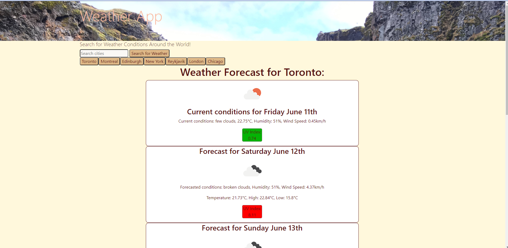

# Weather Conditions App

This is a simple weather app that will allow you to search for weather conditions around the world.

The app will give you current weather as well as a five day forecast. The forecast will give you weather conditions, temperatures (including daily high and low for the five-day forecast), humidity, wind speed, and a UV Index. All weather data was fetched using OpenWeather's Current Weather Data and OneCall APIs.

Your previous searches will be saved to local storage, and you can easily access your saved searches again by clicking the buttons with city names under the main search bar.

Stay cool, wear sunscreen, and check the conditions!

Deployed app: https://gleeson-emily.github.io/weather-api/

